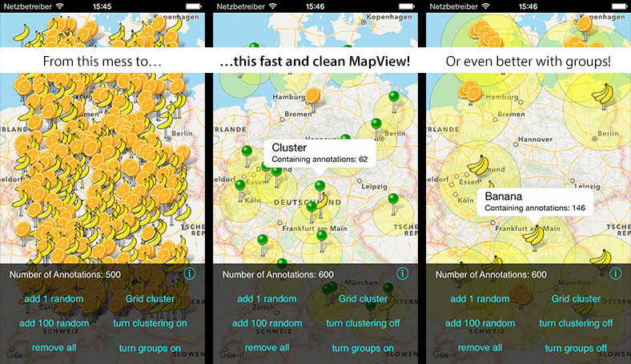
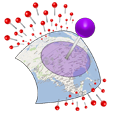

## What is OCMapView?

**OpenClusterMapView** is a simple and easy to use extension of `MKMapView` for iOS. If you are displaying a lot of annotations on the map, this class is made for you.

OCMapView automatically creates clusters by combining annotations super fast.
It works with any iOS application. No code changes needed.

## Screenshots:

## Features

- Fast and easy! Handle **over 9000** annotations on the map at once.
- Very simple usage! No code changes needed, just replace the MapView class
- Easy to integrate! Keep all `MKMapView` delegate methods as they are
- Customize the `MKAnnotationViews` of generated clusters like any other annotation
- Customize behavior like the cluster size
- Two different clustering algorithms
- Provide an ignore list of annotations, that wont be clustered
- Create independent clusters by using groups

## Setup

### Cocoapods

- Just install the pod using `pod 'OCMapView'` 

### Manually

- Add the `OCMapView` folder to your project. 
- Link with the `MapKit` and `CoreLocation` frameworks

## Background:

You may already have encountered the problem: When adding a several hundred annotations to the `MKMapView`, it will get laggy and everything but user friendly.

Many developers believe that iOS can't handle a huge amount of annotations on a `MKMapView` due to the low memory capacities of iDevices. So they start to handle the annotation management themselves with pretty dumb filter methods which won't display all annotations and confuse users even more.  

The actual problem is not memory related. It rather occurs because *annotationViews* are `UIViews` and these are extremely slow. So if you scroll/zoom a `MKMapView` with many annotations, iOS has to redraw them all at once and that will take time.  

**OCMapView** combines multiple annotations in a specified range and displays them just as ***a single*** `annotationView` for the whole cluster. So you'll never have too many views which make your app slow and laggy. In addition to that forget to handle the annotations yourself! Just add them **all** to your **OCMapView** and it will do everything for you. Even the iPhone 3G with iOS 3.1.x can handle a couple thousand annotations without lagging!

## Usage

Just replace your `MKMapView` references with `OCMapView`. It automatically handles annotations and combines them to **clusters** for you without any other change of your code.

Add the annotations you want to display as usual and implement the same `MKMapViewDelegate` methods like before. The handling stays completely the same so you can easily use custom views for your annotations and clusters. The `viewForAnnotation` delegate method will return `OCAnnotation` objects for generated clusters. This is how to provide custom views:

    - (MKAnnotationView *)mapView:(MKMapView *)aMapView viewForAnnotation:(id <MKAnnotation>)annotation{  
        // if it's a cluster  
        if ([annotation isKindOfClass:[OCAnnotation class]]) {  
            // create your custom cluster annotationView here!  
        }  
        // If it's a single annotation  
        else if([annotation isKindOfClass:[Your_Annotation class]]){  
            // create your custom annotationView  as regular here!  
        }  
        return Your_annotationView;  
    }

For more informations, have a look at the example project.

## Grouping

You can cluster different groups of annotations, as seen on the screenshots above, like this:

Implement the `OCGrouping` protocol on your annotation class, set its grouping-tag and set the `clusterByGroupTag` property of your `OCMapView` to `true`. Take a look at the sample project to see how it works.

## Contribute
Apps that use OCMapView:
- official Car2Go App
- cost control for Car2Go aka. aCar2Go
- AbHof
- and a lot of more who do not tell me ;)

If you are using OCMapView and want to contribute, please contact me to add your app to the list of supporting apps!

